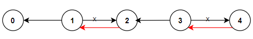

# Problem

There is a network with N roads and N + 1 cities. The cities are labeled with distinct integers within the range [O..N]. 


Roads connect the cities in such a way that there is exactly one way to travel between any two of the cities. In other words, the network forms a tree. 

The roads in the network are too narrow to accommodate two cars. For this reason, every road (that connects cities A and B) is oriented in one of two possible ways: either from A to B, or from B to A. If the road is oriented from A to B, then every car traveling from B to A has to give way to cars traveling from A to B. This, naturally, makes traveling from A to B much faster than traveling from B to A.


A big hospital was recently founded in the city labeled 0. For that reason, the citizens have decided to rearrange the orientation of the roads so that everyone can get to the hospital as quickly as possible. This means that the trip from every city to the other city should not go through any road that faces against the current direction of travel. In order to minimize the cost of this operation, they would like to reorient as few roads as possible. 


Write a function: 

```int solution (vector int> &A, vector<int> &B);```

that, given the description of the network as two arrays A, B of N integers each, returns the minimum number of roads that must be reoriented in order to make everyone's trip to the hospital as fast as possible. 


Arrays A and B describe the network in the following way: 

for each K in the range [0..N-1], there is a road between cities labeled A[K] and B[K] that is oriented from A[K] to B[K]. 


Examples: 

1. Given A = [1, 1, 3, 3] and B = [0, 2, 2, 4], your function should return 2. 

The citizens should reorient the roads between the following cities: 

* 1 and 2, 

* 3 and 4


-   (roads to be reversed are marked in red). 


2. Given A = [1,6,6,3,0,5] and B = [6, 2, 0, 0, 4, 0], your function should return 2. The citizens should reorient the roads between the following cities: 
*  0 and 4
*  6 and 2 


3. Given A = [0,1,1,1,1] and B = [1,2,3,4,5], your function should return 5. The citizens should reorient all the roads


Write an efficient algorithm for the following assumptions: 
* N is an integer within the range (1..100,000); 
* arrays A and B contain integers from range [0..N] and every such integer appears at least once in A or in B; 
* arrays A and B have equal lengths;
* there is exactly one way to travel between every pair of cities


# Solution

* Convert the given array representing roads (edges) into an adjacency list 
* Store for each city (node) the direction of travel
* traverse using classic DFS for graph traversal 
* mark the city as visited
* check the direction and increase the orientation counter if we need to reorient


## Comments

So far the `roadsbfs.go` seems to be more optimal solution